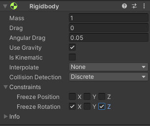

# II-P2

## Ejercicio 1:

Creamos una escena basica para probar la fisica en unity. esta escena solo tiene un cubo, una esfera y un plano como suelo.

* a: Ninguno de los objetos es fisico asi quedan simplemente como estan al principio

* b: Ya que la esfera tiene fisica y el cubo no, la esfera empiza a caer por la gravedad simulada.

* c: si ambos tienen fisica, ambos empizan a caer

* d: ambos objetos son fisicos pero la esfera tiene 10x el peso del cubo, pero todavia caen igual porque no tiene en cuenta la friccion del aire.

* e: si la esfera tiene fisica y el cubo es de tipo triger, solo la esfera va a caer ya que solo ella entra en el bucle de fisica.

configuracion del cubo:

* f: En el caso que el cubo es de tipo triger y tiene asignado fisica podemos observar que cae pero que no colisiona con el suelo ya que su collider es de tipo trigger. (la esfera no cambia su comportamiento)

* g: tenemos otra vez los mismo como en 1d, con el cambio que se impide la rotacion sobre los ejex xz del cubo, que en el setup que tenemos no se ve ya que el cubo no se esta rotando.

La configuracion para impedir la rotacion en los ejex xz:

## Ejercicio 2:
